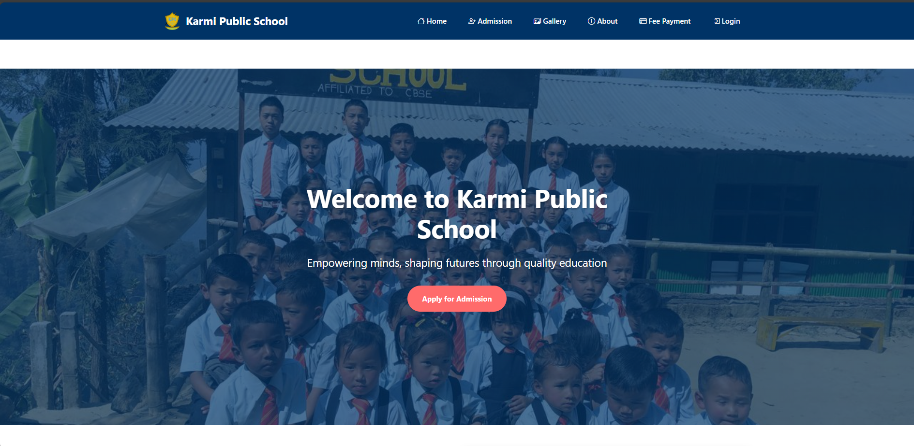
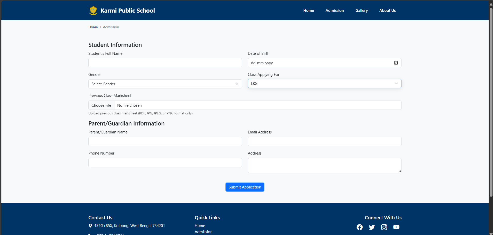
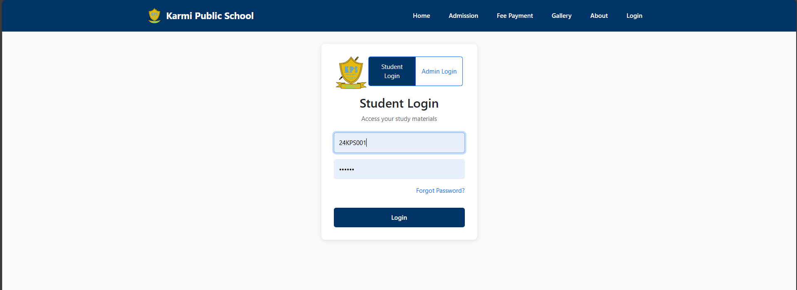

# Karmi Public School - School Management System

## Project Overview

This is a comprehensive school management system website for Karmi Public School, featuring multiple pages for different functionalities including admissions, fee payments, study materials, gallery, and administrative functions.

## Features

### Main Pages

  
**Home Page**: Welcome page with school information and quick links

  
**About Us**: School history, mission, and achievements

  
**Admission**: Online admission form with class selection

  
**Login/Student Login**: Authentication for students and admin

### Admin Features

- Dashboard for managing admission applications
- Application status tracking (Pending/Approved/Denied)
- Statistics and filtering capabilities
- Payment status verification

### Student Features

- Secure login system
- Access to class-specific study materials
- Fee payment portal
- Viewing school notices and announcements

## Technologies Used

**Frontend**:
- HTML5, CSS3, JavaScript
- Bootstrap 5 for responsive design
- Font Awesome and Bootstrap Icons
- SweetAlert2 for alerts and notifications

**Backend Integration**:
- REST API endpoints for data handling
- Local storage for session management (for demo purposes)

## Setup Instructions

1. Clone or download the repository.
2. Open the `index.html` file in any modern web browser.
3. For full functionality (especially admin features), a backend server would be required to handle API requests.

## Demo Credentials

### Student Login

## Notes

- This is a frontend demo project. In a production environment, you would need:
  - A backend server to handle API requests
  - Database integration for persistent data storage
  - Proper authentication and security measures
- Some features use localStorage for demo purposes which would be replaced with proper session management in a production environment

## License

This project is for educational/demonstration purposes. Please ensure proper licensing for production use.

